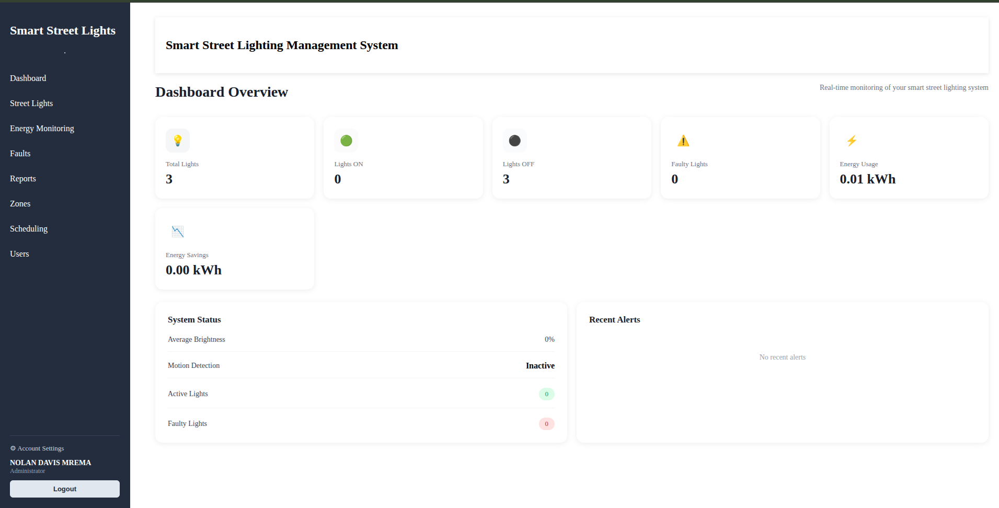

# Smart Street Lighting System

A full-stack IoT platform for monitoring and controlling street lighting infrastructure, built by **Group 13 (CN286)** at Ardhi University.

The system combines ESP32-based lighting nodes, an MQTT messaging layer, a Node.js/Express API, a PostgreSQL database, and a React dashboard to give infrastructure engineers real-time visibility and control over street lights and their energy consumption.




## Features

- **Real-time zone control** — turn lights on/off and monitor status per zone from a web dashboard
- **Energy monitoring** — per-node power/energy readings via PZEM-004T sensors, aggregated over time (hourly/daily/monthly) using PostgreSQL `date_trunc()`
- **Role-based access control (RBAC)** — three roles with distinct permissions:
  - **Administrator** — full system access, user management
  - **Infrastructure Engineer** — zone/node configuration and control
  - **Maintenance Engineer** — monitoring and fault reporting
- **JWT authentication** — secure, stateless session management
- **MQTT-based device communication** — ESP32 nodes publish/subscribe via a Mosquitto broker
- **Independent node connectivity** — each ESP32 node connects directly over WiFi/MQTT (no inter-node ESP-NOW dependency), improving reliability


## Architecture

```
┌──────────────────┐         MQTT        ┌──────────────────┐        HTTP/REST        ┌──────────────────┐
│    ESP32 Node    │ ◄─────────────────► │ Mosquitto Broker │ ◄─────────────────────► │   Backend API    │
│    (x3, WiFi)    │                     │                  │                         │  (Node/Express)  │
└──────────────────┘                     └──────────────────┘                         └──────────────────┘
          │                                                                                     │
          │ PZEM-004T                                                                           │
          │ energy readings                                                                    ▼
          ▼                                                                           ┌──────────────────┐
┌──────────────────┐                                                                  │    PostgreSQL    │
│   Street Light   │                                                                  │     Database     │
│     Hardware     │                                                                  └──────────────────┘
└──────────────────┘                                                                                   │
                                                                                                ▼
                                                                                      ┌──────────────────┐
                                                                                      │  React Frontend  │
                                                                                      │    Dashboard     │
                                                                                      └──────────────────┘
```

Each ESP32 node connects independently to WiFi and communicates with the backend through the MQTT broker. The backend subscribes to node topics, persists data to PostgreSQL, and exposes a REST API consumed by the React dashboard.


## Tech Stack

| Layer | Technology |
|---|---|
| Hardware | ESP32 (Arduino/C++), PZEM-004T energy sensor |
| Messaging | MQTT (Mosquitto broker) |
| Backend | Node.js, Express.js |
| Database | PostgreSQL |
| Frontend | React |
| Auth | JWT, RBAC (3 roles) |


## Repository Structure

```
Smart_Street_Lighting_Monitoring_System/
├── Hardware/          # ESP32 node firmware and circuit/wiring designs
├── backend-server/    # Node.js/Express API + MQTT client
├── frontend/          # React dashboard
├── mqtt/              # Mosquitto broker configuration
└── .gitignore
```

## Getting Started

### Prerequisites

- Node.js (v18+) and npm
- PostgreSQL (v13+)
- Mosquitto MQTT broker
- ESP32 boards + PZEM-004T modules (for hardware nodes)
- PlatformIO or Arduino IDE (for firmware)

### 1. Clone the repository

```bash
git clone https://github.com/Nolan550/Smart_Street_Lighting_Monitoring_System.git
cd Smart_Street_Lighting_Monitoring_System
```

### 2. Set up the database

```bash
createdb smart_street_lighting
psql -d smart_street_lighting -f backend-server/schema.sql
```

### 3. Configure the backend

```bash
cd backend-server
npm install
cp .env.example .env
npm start
```

Example `.env` variables:
```
DB_HOST=localhost
DB_PORT=5432
DB_NAME=smart_street_lighting
DB_USER=postgres
DB_PASSWORD=your_password
MQTT_BROKER_URL=mqtt://localhost:1883
JWT_SECRET=your_jwt_secret
PORT=5000
```

### 4. Start the MQTT broker

```bash
cd mqtt
mosquitto -c mosquitto.conf
```

### 5. Set up the frontend

```bash
cd frontend
npm install
npm start
```

The dashboard should now be available at `http://localhost:3000`.

### 6. Flash the ESP32 nodes

Open the `Hardware/` folder in PlatformIO or Arduino IDE, update the WiFi credentials and MQTT broker address, then flash each node.


## User Roles

| Role | Permissions |
|---|---|
| Administrator | Full access, manage users and roles |
| Infrastructure Engineer | Configure zones/nodes, control lighting |
| Maintenance Engineer | View status, monitor energy, report faults |


## Energy Monitoring

Energy data is collected from PZEM-004T sensors on each node, filtered for sane readings, and stored with the raw timestamp. The API aggregates this data using PostgreSQL's `date_trunc()` function to provide hourly, daily, and monthly consumption views on the dashboard.


## Project Team

Group 13, CN286 — Ardhi University (ARU), Dar es Salaam, Tanzania.


## License

This project is licensed under the MIT License.
